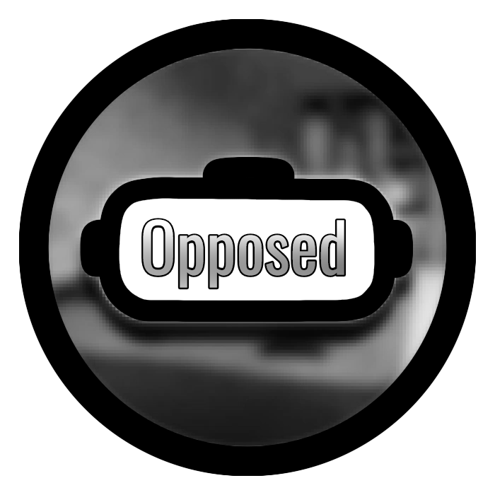
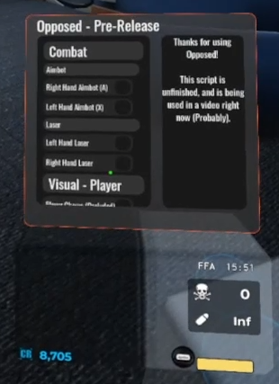

# Opposed


The repository hosting Opposed for Opposer VR. Created by OpposedDev (Aka. Hackeroo) 
> [!WARNING]
> THIS SCRIPT IS PUBLIC, BUT I HAVE NOT COMPLETELY RELEASED THE MENU. THINGS MAY CHANGE BEFORE THE FIRST RELEASE.

# Information ℹ️
Opposed is a roblox script that allows for people to gain advantages while playing Opposer VR in PCVR.

Opposed contains features such as VR Aimbot and Kill All.



## Loadstring
```
loadstring(game:HttpGet("https://raw.githubusercontent.com/OpposedDev/Opposed/refs/heads/main/main/loader.lua"))()
```

# Features ⚙️
If you've used "Hackeroo's Opposer VR Menu," some of these options have been reworked to work properly in today's Opposer VR.
There are also brand new options, which are OP.

## Combat ⚔️
- VR Aimbot (Left and Right Hand, seperate toggles for each)
- Gun Lasers (Left and Right Hand, seperate toggles for each)

## Visuals 👁️
### Player 🚶
- Occluded Chams
- Chams
- Boxes
- Names

### Items 🍕
- Chams
- Names

## Miscllaneous
- Jetpack (Fly, Configurable)
- Gravity Override (Configurable)
- Right Arm Kill All (OP)
- Bring All Guns (Buggy, May fail due to Network Ownership)
- Bring All Secret Guns (May fail due to Network Ownership)

# Known Issues
- Chams may bug, toggle between occluded and normal chams to fix.
